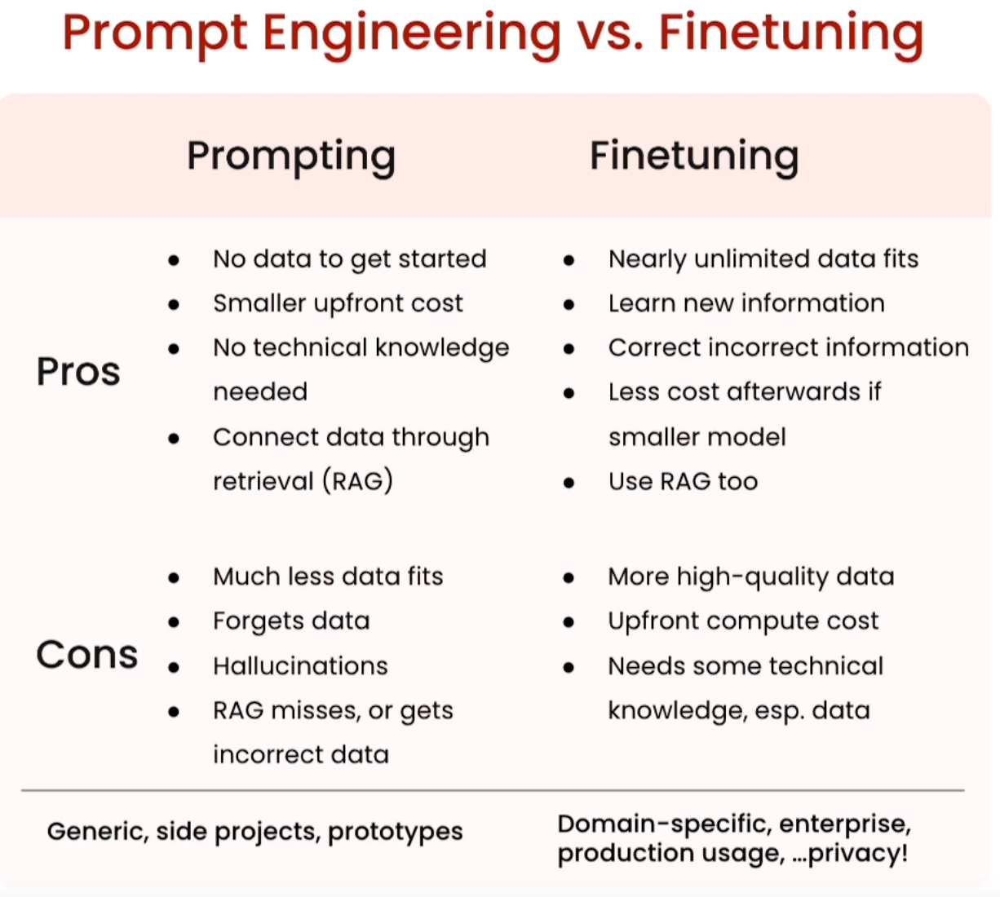

# Why finetune

## What is finetuning

Taking these general purpose models like GPT-3 and specializing them into something 
like ChatGPT, the specific chat use case to make it chat well, or using GPT-4 
and turning that into a specialized GitHub co-pilot use case to auto-complete code. 

## What does finetuning do for the model

- Makes it possible for you to give it a lot more data than what fits into 
the prompt so that your model can learn from that data rather than just get access to it

e.g. A model that is fine-tuned on dermatology data however might take in the same symptoms and be 
able to give you a much clearer, more specific diagnosis. 

- Helps steer the model to more consistent outputs or more consistent behavior. 

For example, you can see the base model here. When you ask it, what's your first name? 
It might respond with, what's your last name? Because it's seen so much survey data out there of different questions. 
 
So it doesn't even know that it's supposed to answer that question. 
But a fine-tuned model by contrast, when you ask it, what's your 
first name? would be able to respond clearly. My first name is Sharon. 

- Reduces hallucinations
- Customizes the model to a specific use case
- Process is similar to the model's earlier training

## Prompt Engineering vs. Finetuning

### Prompt Pros Explain

- smaller upfront cost, so you don't really need to think about cost, since every single time you ping 
the model, it's not that expensive.
-  RAG, to connect more of your data to it, to selectively choose what kind of data goes into the prompt.
 
### Prompt Cons Explain

- Oftentimes when you do try to fit in a ton of data, unfortunately it will forget a lot of that data. 
- Hallucination, which is when the model does make stuff up and it's hard to **correct** that incorrect information that it's already learned.
- RAG often miss the right data,get the incorrect data and cause the model, to output the wrong thing.

### Finetune Pros Explain

- you can correct that incorrect information that it may have learned before, or even put in recent information that it hadn't learned about previously
- There's less compute cost afterwards if you do fine-tune a smaller model and this is particularly relevant if you expect to hit the model a lot of times
- RAG connects it with far more data as well even after it's learned all this information

## Benefits of finetuning your own LLM

- Performance
  - stops the LLM from making stuff up, especially around your domain.
  - It can be far more consistent.
  - better at moderating. Reduce unwanted info, esp. about your company

- Privacy
  - in your VPC or on premise
  - prevents data leakage and data breaches that might happen on off the shelf, third party solutions.
    This is one way to keep that data safe that you've been collecting for a while.

- Cost
  - cost transparency.
  - lower the cost per request. fine tuning a smaller LLM can actually help you do that. 
  - greater control over costs and a couple other factors as well. 

- Reliability
  - control uptime
  - lower latency. You can greatly reduce the latency for certain applications like autocomplete.
  - moderation. Basically, if you want the model to say, I'm sorry to certain things, or to say, I don't know
    to certain things, or even to have a custom response, This is one way to actually provide those guardrails to the model. 

# Where finetuning fits in

## Finetuning data: compare to pretraining and basic preparation

### Pretraining

First step before fine-tuning even happens.

- Model at the start
  - zero knowledge about the world: weights are completely random
  - can't form english words: no language skill
- Next token prediction is the objective
- Giant corpus of text data that often scraped from the internet: "unlabeled". A lot of manual work to 
  getting this data set to be effective for model pre-training even after many cleaning processes.
