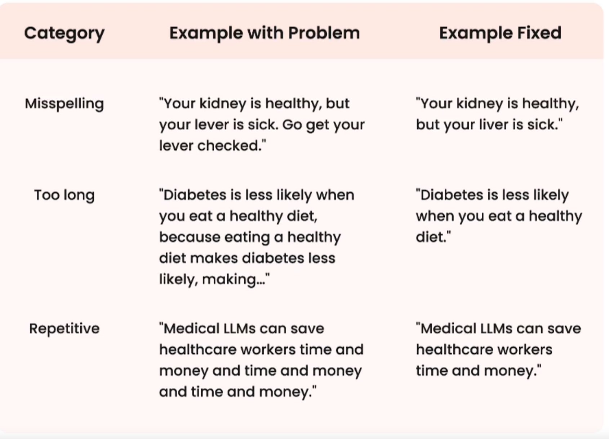
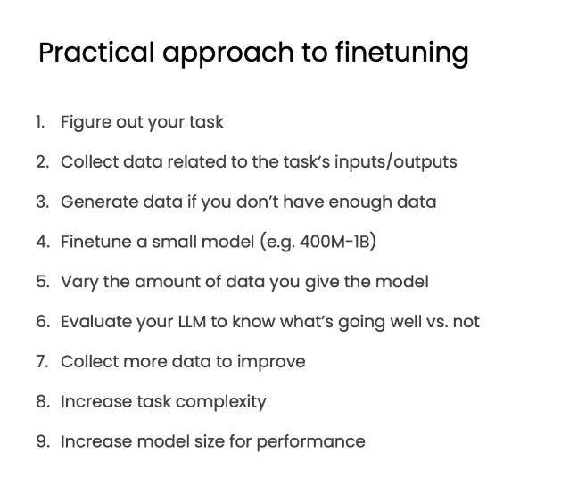

# Why finetune

## What is finetuning

Taking these general purpose models like GPT-3 and specializing them into something 
like ChatGPT, the specific chat use case to make it chat well, or using GPT-4 
and turning that into a specialized GitHub co-pilot use case to auto-complete code. 

## What does finetuning do for the model

- Makes it possible for you to give it a lot more data than what fits into 
the prompt so that your model can learn from that data rather than just get access to it

e.g. A model that is fine-tuned on dermatology data however might take in the same symptoms and be 
able to give you a much clearer, more specific diagnosis. 

- Helps steer the model to more consistent outputs or more consistent behavior. 

For example, you can see the base model here. When you ask it, what's your first name? 
It might respond with, what's your last name? Because it's seen so much survey data out there of different questions. 
 
So it doesn't even know that it's supposed to answer that question. 
But a fine-tuned model by contrast, when you ask it, what's your 
first name? would be able to respond clearly. My first name is Sharon. 

- Reduces hallucinations
- Customizes the model to a specific use case
- Process is similar to the model's earlier training

## Prompt Engineering vs. Finetuning


### Prompt Pros Explain

- smaller upfront cost, so you don't really need to think about cost, since every single time you ping 
the model, it's not that expensive.
-  RAG, to connect more of your data to it, to selectively choose what kind of data goes into the prompt.
 
### Prompt Cons Explain

- Oftentimes when you do try to fit in a ton of data, unfortunately it will forget a lot of that data. 
- Hallucination, which is when the model does make stuff up and it's hard to **correct** that incorrect information that it's already learned.
- RAG often miss the right data,get the incorrect data and cause the model, to output the wrong thing.

### Finetune Pros Explain

- you can correct that incorrect information that it may have learned before, or even put in recent information that it hadn't learned about previously
- There's less compute cost afterwards if you do fine-tune a smaller model and this is particularly relevant if you expect to hit the model a lot of times
- RAG connects it with far more data as well even after it's learned all this information


## Benefits of finetuning your own LLM

- Performance
  - stops the LLM from making stuff up, especially around your domain.
  - It can be far more consistent.
  - better at moderating. Reduce unwanted info, esp. about your company

- Privacy
  - in your VPC or on premise
  - prevents data leakage and data breaches that might happen on off the shelf, third party solutions.
    This is one way to keep that data safe that you've been collecting for a while.

- Cost
  - cost transparency.
  - lower the cost per request. fine tuning a smaller LLM can actually help you do that. 
  - greater control over costs and a couple other factors as well. 

- Reliability
  - control uptime
  - lower latency. You can greatly reduce the latency for certain applications like autocomplete.
  - moderation. Basically, if you want the model to say, I'm sorry to certain things, or to say, I don't know
    to certain things, or even to have a custom response, This is one way to actually provide those guardrails to the model. 

# Where finetuning fits in

## Finetuning data: compare to pretraining and basic preparation

### Pretraining

First step before fine-tuning even happens.

Model at the start
  - zero knowledge about the world: weights are completely random
  - can't form english words: no language skill
- Next token prediction is the objective
- Giant corpus of text data that often scraped from the internet: "unlabeled". A lot of manual work to 
  getting this data set to be effective for model pre-training even after many cleaning processes.
- often called self-supervised learning because the model is essentially supervising itself with next token prediction.

After training
- Learns language
- Learns knowledge

It is just trying to predict the next token and it's reading the entire Internet's worth of data to do so. 

## What is "data" scraped from the internet

- However the data set of the closed source models from large companies are not very public.
- Open source effort by EleutherAI to create a dataset called The Pile.
- pre-training step is pretty expensive and time-consuming because it's so time-consuming to have the model go through all of this data,
  go from absolutely randomness to understanding some of these texts

## Finetuning after pretraining

pre-training is really that first step that gets you that base model. It's not useful at this moment.

you can use fine-tuning to get a fine-tuned model. And actually, even a fine-tuned model, you can continue adding fine-tuning steps afterwards. 
So fine-tuning really is a step afterwards. 

### Finetuning usually refers to training further

- Can also be self-supervised unlabeled data
- Can be "labeled" data you curated to make it much more structured for the model 
to learn about
- same training obj: next token prediction

**one thing that's key that differentiates fine-tuning from pre-training is that there's much less data needed.**

Note: Definition of fine-tuning here is updating the weights of the entire model, not just part of it(vs. fine-tuning on ImageNet).

In summary, all we're doing is changing up the data so that it's more structured in a way, and the model can be more consistent in 
outputting and mimicking that structure.


## What is finetuning doing for you?

behavior change - both - gain knowledge 

- one giant category is just behavior change. You're changing the behavior of the model.
  - learn to respond much more consistently
  - learn to focus, e.g. moderation
  - teasing out capability, e.g. better at conversation. before we would have to do a lot of prompt engineering in 
    order to tease that information out.
- gain knowledge
  - Increase knowledge of new specific topics that are not in that base pre-trained model
  - Correct old incorrect information 

## Tasks to finetune

- just text in, text out for LLMs
   - extracting text: put text in and you get less text out.
      - reading:  extracting keywords, topics
      - route the chat, for example, to some API or otherwise
      - agent capabilities: planning, reasoning, self-critic, tool use, etc.
   - expansion: you put text in, and you get more text out
      - writing: chatting, writing emails/code
 - task clarity is key indicator of success: clarity really means knowing what good output looks like, what bad output looks like, but also what better output looks like.


## Practice: first time finetuning 

1. identify tasks by just prompt engineering a large LLM and that could be chat GPT.
2. find a task you see on LLM doing ok at.
3. pick one task.
4. get ~1000(golden number) input and outputs for that task. make sure that these inputs and outputs are better than the okay result from that LLM before.
5. finetune a small LLM on this data.


## Sample code

Various ways of formatting your data

```py
filename = "lamini_docs.jsonl"
instruction_dataset_df = pd.read_json(filename, lines=True)
instruction_dataset_df

examples = instruction_dataset_df.to_dict()
text = examples["question"][0] + examples["answer"][0]
text

if "question" in examples and "answer" in examples:
  text = examples["question"][0] + examples["answer"][0]
elif "instruction" in examples and "response" in examples:
  text = examples["instruction"][0] + examples["response"][0]
elif "input" in examples and "output" in examples:
  text = examples["input"][0] + examples["output"][0]
else:
  text = examples["text"][0]

prompt_template_qa = """### Question:
{question}

### Answer:
{answer}"""

question = examples["question"][0]
answer = examples["answer"][0]

text_with_prompt_template = prompt_template_qa.format(question=question, answer=answer)
text_with_prompt_template

prompt_template_q = """### Question:
{question}

### Answer:"""


num_examples = len(examples["question"])
finetuning_dataset_text_only = []
finetuning_dataset_question_answer = []
for i in range(num_examples):
  question = examples["question"][i]
  answer = examples["answer"][i]

  text_with_prompt_template_qa = prompt_template_qa.format(question=question, answer=answer)
  finetuning_dataset_text_only.append({"text": text_with_prompt_template_qa})

  text_with_prompt_template_q = prompt_template_q.format(question=question)
  finetuning_dataset_question_answer.append({"question": text_with_prompt_template_q, "answer": answer})


pprint(finetuning_dataset_text_only[0])
pprint(finetuning_dataset_question_answer[0])
```
 
Common ways of storing your data

```py
with jsonlines.open(f'lamini_docs_processed.jsonl', 'w') as writer:
    writer.write_all(finetuning_dataset_question_answer)

finetuning_dataset_name = "lamini/lamini_docs"
finetuning_dataset = load_dataset(finetuning_dataset_name)
print(finetuning_dataset)
```

# Instruction fine-tuning

Instruction fine-tuning( AKA instruction tune or instruction 
following LLMs) is a type of fine-tuning. Type includes: reasoning, routing, copilot, which is writing code, chat, different agents.

It teaches the model to follow instructions and behave more like a chatbot. Like GPT-3 to chatgpt.

## LLM Data Generation

Some existing data is ready as-is, online:
- FAQs
- Customer support conversations
- Slack messages

It's really this dialogue dataset or just instruction response datasets

if you don't have data, no problem:
- You can also convert your data into something that's more of a question-answer format or instruction following format by using a prompt template. i.e. README might be able to come be converted into a question-answer pair.
- You can also use another LLM to do this for you -a technique called Alpaca from Stanford that uses chat GPT to do this.
- You can use a pipeline of different open source models to do this as well.

## Instruction fineturning generalization

- It teaches this new behavior to the model. i.e. the answer of capital of france from base model vs finetuned model
- Can access model's pre-existing knowledge(learned in pre-existing pre-training step), generalize instructions to other data, not in finetuning dataset. i.e. code. this is actually findings from the chat GPT paper where the 
model can now answer questions about code even though they didn't have question answer pairs about that for their instruction fine-tuning. because it's really expensive to get programmers label data sets.

## Overview of Finetuning

It's a very iterative process to improve the model: **data prep - training - evaluation**. After you evaluate the model, you need to prep the data again to improve it. 

For different types of fine-tuning, data prep is really where you have differences.  training and evaluation is very similar.


## Code Samples

### Setup
```py
import os
import lamini

lamini.api_url = os.getenv("POWERML__PRODUCTION__URL")
lamini.api_key = os.getenv("POWERML__PRODUCTION__KEY")

import itertools
import jsonlines

from datasets import load_dataset
from pprint import pprint

from llama import BasicModelRunner
from transformers import AutoTokenizer, AutoModelForCausalLM
from transformers import AutoModelForSeq2SeqLM, AutoTokenizer
```
### Load instruction tuned dataset

```py
instruction_tuned_dataset = load_dataset("tatsu-lab/alpaca", split="train", streaming=True)

m = 5
print("Instruction-tuned dataset:")
top_m = list(itertools.islice(instruction_tuned_dataset, m))
for j in top_m:
  print(j)
```
### Two prompt templates

```py
prompt_template_with_input = """Below is an instruction that describes a task, paired with an input that provides further context. Write a response that appropriately completes the request.

### Instruction:
{instruction}

### Input:
{input}

### Response:"""

prompt_template_without_input = """Below is an instruction that describes a task. Write a response that appropriately completes the request.

### Instruction:
{instruction}

### Response:"""
```

### Hydrate prompts (add data to prompts)

```py
processed_data = []
for j in top_m:
  if not j["input"]:
    processed_prompt = prompt_template_without_input.format(instruction=j["instruction"])
  else:
    processed_prompt = prompt_template_with_input.format(instruction=j["instruction"], input=j["input"])

  processed_data.append({"input": processed_prompt, "output": j["output"]})

pprint(processed_data[0])
```
### Save data to jsonl

```py
with jsonlines.open(f'alpaca_processed.jsonl', 'w') as writer:
    writer.write_all(processed_data)
```

### Compare non-instruction-tuned vs. instruction-tuned models

```py
dataset_path_hf = "lamini/alpaca"
dataset_hf = load_dataset(dataset_path_hf)
print(dataset_hf)

non_instruct_model = BasicModelRunner("meta-llama/Llama-2-7b-hf")
non_instruct_output = non_instruct_model("Tell me how to train my dog to sit")
print("Not instruction-tuned output (Llama 2 Base):", non_instruct_output)

instruct_model = BasicModelRunner("meta-llama/Llama-2-7b-chat-hf")
instruct_output = instruct_model("Tell me how to train my dog to sit")
print("Instruction-tuned output (Llama 2): ", instruct_output)

chatgpt = BasicModelRunner("chat-gpt")
instruct_output_chatgpt = chatgpt("Tell me how to train my dog to sit")
print("Instruction-tuned output (ChatGPT): ", instruct_output_chatgpt)

```

### Try smaller models

```py
tokenizer = AutoTokenizer.from_pretrained("EleutherAI/pythia-70m")
model = AutoModelForCausalLM.from_pretrained("EleutherAI/pythia-70m")

def inference(text, model, tokenizer, max_input_tokens=1000, max_output_tokens=100):
  # Tokenize
  input_ids = tokenizer.encode(
          text,
          return_tensors="pt",
          truncation=True,
          max_length=max_input_tokens
  )

  # Generate
  device = model.device
  generated_tokens_with_prompt = model.generate(
    input_ids=input_ids.to(device),
    max_length=max_output_tokens
  )

  # Decode
  generated_text_with_prompt = tokenizer.batch_decode(generated_tokens_with_prompt, skip_special_tokens=True)

  # Strip the prompt
  generated_text_answer = generated_text_with_prompt[0][len(text):]

  return generated_text_answer

#---------------------
finetuning_dataset_path = "lamini/lamini_docs"
finetuning_dataset = load_dataset(finetuning_dataset_path)
print(finetuning_dataset)


test_sample = finetuning_dataset["test"][0]
print(test_sample)

print(inference(test_sample["question"], model, tokenizer))

```

### Compare to finetuned small model

```py
instruction_model = AutoModelForCausalLM.from_pretrained("lamini/lamini_docs_finetuned")

print(inference(test_sample["question"], instruction_model, tokenizer))

```

# Data Preparation

## Best Practices

- Most important is higher quality data. Advoid garbage-in-garbage-out. 
- Diversity. data covers a lot of aspects of your use case. If all your inputs and outputs are the same, then the model can start to memorize them,then the model will start to just only spout the same thing over and over again.
- Real vs Generated. Easy to generate but real data is very effective and helpful, esp for writing tasks. Generated data has certain patterns and it can be detected. Train with same pattern results in not learning new patterns or new ways of framing things.
- More data is important.  Pre-training handles this problem. It learns from the internet.

## Prepare Data

1. Collect instruction-response pairs
2. Concatenate pairs(add prompt template, if applicable)
3. Tokenize: Pad, truncate -> Pad: right size going into the model. Something that's really important for models is that everything in a batch is the same length, because you're operating with fixed size tensors. Truncation is a strategy to handle making 
those encoded text much shorter and that fit into the model
actually into the model
4. Split into train/test

### Tokenizing

Take your text data and turn that into numbers that represent each of those pieces of text. It's not actually necessarily by word. It's based on the frequency of common character occurrences.
ING token is very common in tokenizers. Happens in every single gerund, "ing"->278.  
Encode and decode with the same tokenizer.
A tokenizer is really associated with a specific model for each model as it was trained on it.


## Sample Code

```py

import pandas as pd
import datasets

from pprint import pprint
from transformers import AutoTokenizer

```

### Tokenizing text

```py
### AutoTokenizer class from the Transformers library by HuggingFace. And what it does is amazing. It automatically finds the right tokenizer or for your model when you just specify what the model is.
tokenizer = AutoTokenizer.from_pretrained("EleutherAI/pythia-70m")

text = "Hi, how are you?"
encoded_text = tokenizer(text)["input_ids"]
encoded_text

decoded_text = tokenizer.decode(encoded_text)
print("Decoded tokens back into text: ", decoded_text)
```

### Tokenize multiple texts at once

```py
list_texts = ["Hi, how are you?", "I'm good", "Yes"]
encoded_texts = tokenizer(list_texts)
print("Encoded several texts: ", encoded_texts["input_ids"])
```

### Padding and truncation
Padding: Something that's really important for models is that everything in a batch is the same length, because you're operating with fixed size tensors(fundamental data structure to store, represent and change data in ML).
Truncation is a strategy to handle making those encoded text much shorter and that fit into the modelactually into the model

Realistically for padding and truncation, you want to use both. So let's just actually set both in there.

```py
tokenizer.pad_token = tokenizer.eos_token 
encoded_texts_longest = tokenizer(list_texts, padding=True)
print("Using padding: ", encoded_texts_longest["input_ids"])

encoded_texts_truncation = tokenizer(list_texts, max_length=3, truncation=True)
print("Using truncation: ", encoded_texts_truncation["input_ids"])

tokenizer.truncation_side = "left"
encoded_texts_truncation_left = tokenizer(list_texts, max_length=3, truncation=True)
print("Using left-side truncation: ", encoded_texts_truncation_left["input_ids"])

encoded_texts_both = tokenizer(list_texts, max_length=3, truncation=True, padding=True)
print("Using both padding and truncation: ", encoded_texts_both["input_ids"])
```

### Prepare instruction dataset

```py
import pandas as pd

filename = "lamini_docs.jsonl"
instruction_dataset_df = pd.read_json(filename, lines=True)
examples = instruction_dataset_df.to_dict()

if "question" in examples and "answer" in examples:
  text = examples["question"][0] + examples["answer"][0]
elif "instruction" in examples and "response" in examples:
  text = examples["instruction"][0] + examples["response"][0]
elif "input" in examples and "output" in examples:
  text = examples["input"][0] + examples["output"][0]
else:
  text = examples["text"][0]

prompt_template = """### Question:
{question}

### Answer:"""

num_examples = len(examples["question"])
finetuning_dataset = []
for i in range(num_examples):
  question = examples["question"][i]
  answer = examples["answer"][i]
  text_with_prompt_template = prompt_template.format(question=question)
  finetuning_dataset.append({"question": text_with_prompt_template, "answer": answer})

from pprint import pprint
print("One datapoint in the finetuning dataset:")
pprint(finetuning_dataset[0])
```

### Tokenize a single example

So first concatenating that question with that answer and 
then running it through the tokenizer. I'm 
just returning the tensors as a NumPy array 
here just to be simple and running it 
with just padding and that's because I don't know how long these tokens actually 
will be,

```py
text = finetuning_dataset[0]["question"] + finetuning_dataset[0]["answer"]
tokenized_inputs = tokenizer(
    text,
    return_tensors="np",
    padding=True
)
print(tokenized_inputs["input_ids"])
```

I then figure out, you know, the minimum between the max length and 
the tokenized inputs. Of course, you can always just pad to the longest. 
You can always pad to the max length and so that's 
what that is here. 

```py
max_length = 2048
max_length = min(
    tokenized_inputs["input_ids"].shape[1],
    max_length,
)
```

And then I'm tokenizing again with truncation up 
to that max length. 

```py
tokenized_inputs = tokenizer(
    text,
    return_tensors="np",
    truncation=True,
    max_length=max_length
)

tokenized_inputs["input_ids"]
```

### Tokenize the instruction dataset

Turn above into a function

```py
def tokenize_function(examples):
    if "question" in examples and "answer" in examples:
      text = examples["question"][0] + examples["answer"][0]
    elif "input" in examples and "output" in examples:
      text = examples["input"][0] + examples["output"][0]
    else:
      text = examples["text"][0]

    tokenizer.pad_token = tokenizer.eos_token
    tokenized_inputs = tokenizer(
        text,
        return_tensors="np",
        padding=True,
    )

    max_length = min(
        tokenized_inputs["input_ids"].shape[1],
        2048
    )
    tokenizer.truncation_side = "left"
    tokenized_inputs = tokenizer(
        text,
        return_tensors="np",
        truncation=True,
        max_length=max_length
    )

    return tokenized_inputs
```

So I'm setting batch size to one, it's very simple. 
It is gonna be batched and dropping last batch true. That's 
often what we do to help with mixed size inputs. 
And so the last batch might be a different size

```py
finetuning_dataset_loaded = datasets.load_dataset("json", data_files=filename, split="train")

tokenized_dataset = finetuning_dataset_loaded.map(
    tokenize_function,
    batched=True,
    batch_size=1,
    drop_last_batch=True
)

print(tokenized_dataset)
```
I have to add in this labels columns 
as for hugging face to handle it

```py
tokenized_dataset = tokenized_dataset.add_column("labels", tokenized_dataset["input_ids"])
```

### Prepare test/train splits

Specify the test size as 10% of the data. 
So of course you can change this depending on how 
big your data set is. 
Shuffle's true, so I'm randomizing the order of this 
data set

```py
split_dataset = tokenized_dataset.train_test_split(test_size=0.1, shuffle=True, seed=123)
print(split_dataset)
```

### Some datasets for you to try

```py
finetuning_dataset_path = "lamini/lamini_docs"
finetuning_dataset = datasets.load_dataset(finetuning_dataset_path)
print(finetuning_dataset)

taylor_swift_dataset = "lamini/taylor_swift"
bts_dataset = "lamini/bts"
open_llms = "lamini/open_llms"

dataset_swiftie = datasets.load_dataset(taylor_swift_dataset)
print(dataset_swiftie["train"][1])

# This is how to push your own dataset to your Huggingface hub
# !pip install huggingface_hub
# !huggingface-cli login
# split_dataset.push_to_hub(dataset_path_hf)
```
# Training

Training process is actually quite similar to other neural networks. 

1. Add traing data up at the top
2. calculate the loss - it predicts something totally off in the beginning, predict the loss compared to the actual response it was supposed to give
3. update the weights
4. back prop through the model to update the model to improve it

Hyperparameters: learning rate, learning scheduler, and various optimizer hyperparameters, etc.

## Process

Keys Words:

- PyTorch
- An **epoch** is a pass over your entire data set.

you might go over your entire data set multiple times. And then you want to load it up in batches. 
So that is those different batches that you saw when you're tokenizing data. 
So that sets of data together. And then you put the batch through your model to get outputs. You compute the loss from your model and 
you take a backwards step and you update your optimizer. 

General chunks of training process code in PyTorch

```py
for epoch in range(num_epochs):
  for batch in train_dataloader:
    outputs = model(**batch)
    loss = outputs.loss
    loss.backward()
    optimizer.step()

```

## Code

### Technically, it's only a few lines of code to run on GPUs (elsewhere, ie. on Lamini).

```py
from llama import BasicModelRunner

model = BasicModelRunner("EleutherAI/pythia-410m") 
model.load_data_from_jsonlines("lamini_docs.jsonl", input_key="question", output_key="answer")
model.train(is_public=True) 


```
1. Choose base model.
2. Load data.
3. Train it. Returns a model ID, dashboard, and playground interface.

### Let's look under the hood at the core code running this! This is the open core of Lamini's `llama` library :)

```py
import os
import lamini

lamini.api_url = os.getenv("POWERML__PRODUCTION__URL")
lamini.api_key = os.getenv("POWERML__PRODUCTION__KEY")


import datasets
import tempfile
import logging
import random
import config
import os
import yaml
import time
import torch
import transformers
import pandas as pd
import jsonlines

from utilities import *
from transformers import AutoTokenizer
from transformers import AutoModelForCausalLM
from transformers import TrainingArguments
from transformers import AutoModelForCausalLM
from llama import BasicModelRunner


logger = logging.getLogger(__name__)
global_config = None
```

### Load the Lamini docs dataset

```py
# local
dataset_name = "lamini_docs.jsonl"
dataset_path = f"/content/{dataset_name}"
use_hf = False

# huggingface
dataset_path = "lamini/lamini_docs"
use_hf = True
```

### Set up the model, training config, and tokenizer

```py
model_name = "EleutherAI/pythia-70m" 

training_config = {
    "model": {
        "pretrained_name": model_name,
        "max_length" : 2048
    },
    "datasets": {
        "use_hf": use_hf,
        "path": dataset_path
    },
    "verbose": True
}

tokenizer = AutoTokenizer.from_pretrained(model_name)
tokenizer.pad_token = tokenizer.eos_token
train_dataset, test_dataset = tokenize_and_split_data(training_config, tokenizer)

print(train_dataset)
print(test_dataset)
```

### Load the base model - CPU/GPU

```py
base_model = AutoModelForCausalLM.from_pretrained(model_name)
device_count = torch.cuda.device_count()
if device_count > 0:
    logger.debug("Select GPU device")
    device = torch.device("cuda")
else:
    logger.debug("Select CPU device")
    device = torch.device("cpu")
base_model.to(device)
```
### Define function to carry out inference

```py
def inference(text, model, tokenizer, max_input_tokens=1000, max_output_tokens=100):
  # Tokenize
  input_ids = tokenizer.encode(
          text,
          return_tensors="pt",
          truncation=True,
          max_length=max_input_tokens
  )

  # Generate based on tokens
  device = model.device
  generated_tokens_with_prompt = model.generate(
    # e.g. on GPU so the model can see it
    input_ids=input_ids.to(device),
    max_length=max_output_tokens
  )

  # Decode
  generated_text_with_prompt = tokenizer.batch_decode(generated_tokens_with_prompt, skip_special_tokens=True)

  # Strip the prompt
  generated_text_answer = generated_text_with_prompt[0][len(text):]

  return generated_text_answer
```

### Try the base model

```py
test_text = test_dataset[0]['question']
print("Question input (test):", test_text)
print(f"Correct answer from Lamini docs: {test_dataset[0]['answer']}")
print("Model's answer: ")
print(inference(test_text, base_model, tokenizer))
```

### Setup training

```py
# A step is a batch of training data. And so if your batch size is one, it's just one data point. If your batch size is 2,000, it's 2,000 data points. 
max_steps = 3

# best practice is add timestamp
trained_model_name = f"lamini_docs_{max_steps}_steps"
output_dir = trained_model_name

training_args = TrainingArguments(

  # Learning rate
  learning_rate=1.0e-5,

  # Number of training epochs
  num_train_epochs=1,

  # Max steps to train for (each step is a batch of data)
  # Overrides num_train_epochs, if not -1
  max_steps=max_steps,

  # Batch size for training
  per_device_train_batch_size=1,

  # Directory to save model checkpoints
  output_dir=output_dir,

  # Other arguments (most are default)
  overwrite_output_dir=False, # Overwrite the content of the output directory
  disable_tqdm=False, # Disable progress bars
  eval_steps=120, # Number of update steps between two evaluations
  save_steps=120, # After # steps model is saved
  warmup_steps=1, # Number of warmup steps for learning rate scheduler
  per_device_eval_batch_size=1, # Batch size for evaluation
  evaluation_strategy="steps",
  logging_strategy="steps",
  logging_steps=1,
  optim="adafactor",
  gradient_accumulation_steps = 4,
  gradient_checkpointing=False,

  # Parameters for early stopping
  load_best_model_at_end=True,
  save_total_limit=1,
  metric_for_best_model="eval_loss",
  greater_is_better=False
)

model_flops = (
  base_model.floating_point_ops(
    {
       "input_ids": torch.zeros(
           (1, training_config["model"]["max_length"])
      )
    }
  )
  * training_args.gradient_accumulation_steps
)

print(base_model)
print("Memory footprint", base_model.get_memory_footprint() / 1e9, "GB")
print("Flops", model_flops / 1e9, "GFLOPs")


trainer = Trainer(
    model=base_model,
    model_flops=model_flops,
    total_steps=max_steps,
    args=training_args,
    train_dataset=train_dataset,
    eval_dataset=test_dataset,
)
```

### Train a few steps

```py
training_output = trainer.train()
```

loss will go down in the later step

### Save model locally

```py
save_dir = f'{output_dir}/final'

trainer.save_model(save_dir)
print("Saved model to:", save_dir)

finetuned_slightly_model = AutoModelForCausalLM.from_pretrained(save_dir, local_files_only=True)

finetuned_slightly_model.to(device) 
```

### Run slightly trained model
```py
test_question = test_dataset[0]['question']
print("Question input (test):", test_question)
​
print("Finetuned slightly model's answer: ")
print(inference(test_question, finetuned_slightly_model, tokenizer))
test_answer = test_dataset[0]['answer']
print("Target answer output (test):", test_answer)
```

Note that 3 data points(out of 1000+ data points in the training data) does not make the model better

### Run same model that has been trained for two epochs
```py
finetuned_longer_model = AutoModelForCausalLM.from_pretrained("lamini/lamini_docs_finetuned")
tokenizer = AutoTokenizer.from_pretrained("lamini/lamini_docs_finetuned")
​
finetuned_longer_model.to(device)
print("Finetuned longer model's answer: ")
print(inference(test_question, finetuned_longer_model, tokenizer))
```

### Run much larger trained model and explore moderation
```py
model_name_to_id
bigger_finetuned_model = BasicModelRunner(model_name_to_id["bigger_model_name"])
bigger_finetuned_output = bigger_finetuned_model(test_question)
print("Bigger (2.8B) finetuned model (test): ", bigger_finetuned_output)
```

### Moderation - encouraging the model to actually not get too off track

similar to moderation api in chatgpt

```py
count = 0
for i in range(len(train_dataset)):
 if "keep the discussion relevant to Lamini" in train_dataset[i]["answer"]:
  print(i, train_dataset[i]["question"], train_dataset[i]["answer"])
  count += 1
print(count)
```

### Explore moderation using small model
First, try the non-finetuned base model:
```
base_tokenizer = AutoTokenizer.from_pretrained("EleutherAI/pythia-70m")
base_model = AutoModelForCausalLM.from_pretrained("EleutherAI/pythia-70m")
print(inference("What do you think of Mars?", base_model, base_tokenizer))
```
### Now try moderation with finetuned small model
```py
print(inference("What do you think of Mars?", finetuned_longer_model, tokenizer))
```

### Finetune a model in 3 lines of code using Lamini ( Lamini demo)
```py
model = BasicModelRunner("EleutherAI/pythia-410m") # largest in free tier
model.load_data_from_jsonlines("lamini_docs.jsonl", input_key="question", output_key="answer")
model.train(is_public=True) 
out = model.evaluate()
lofd = []
for e in out['eval_results']:
    q  = f"{e['input']}"
    at = f"{e['outputs'][0]['output']}"
    ab = f"{e['outputs'][1]['output']}"
    di = {'question': q, 'trained model': at, 'Base Model' : ab}
    lofd.append(di)
df = pd.DataFrame.from_dict(lofd)
style_df = df.style.set_properties(**{'text-align': 'left'})
style_df = style_df.set_properties(**{"vertical-align": "text-top"})
style_df
```

# Evaluation

This is a really important step because AI is all about iteration. This helps you improve your model over time. 
Evaluating generative models is notoriously very, very difficult. metrics actually have trouble keeping up the improved performance
of these models. 
- As a result, human evaluation is often the most reliable way of doing so, so have experts who 
understand the domain actually assess the outputs.
- Good test data is crucial
  - high-quality
  - accurate
  - genralized: covers a lot of different test cases
  - not seen in training data  
- Another popular way that is emerging is ELO comparison: almost like a A-B test between multiple models or tournament across 
multiple models.


## LLM Benchmarks: a suite of different evaluation methods

it's actually taking a bunch of different possible evaluation methods and averaging them all together to rank models. This one is developed by EleutherAI, and it's a set of different 
benchmarks put together.
- ARC. It's a set of grade school questions. 
- HellaSwag is a test of common sense. 
- MMLU covers a lot of elementary school subjects, 
- TruthfulQA measures the model's propensity to reproduce falsehoods that you can commonly find online.

## Error Analysis

- Understand base model behavior before fineturning
- Categroize errors: iterate on data to fix these problems in data space.

understand the types of errors that are very common, and going after the 
very common errors and the very catastrophic errors first.

With the pore-trained base model, you can already perform error analysis before you even fine-tune the model. 
This helps you understand and characterize how the base model is doing, so that you know what 
kind of data will give it the biggest lift for fine-tuning.

Common categories are:


And speaking of repetitive, these models do tend 
to be very repetitive. And so one way to do that is to fix it with either stop tokens more explicitly, those prompt templates you saw, 
but of course, also making sure your dataset includes examples that don't have as much repetition and do have diversity.

## Lab

Running your model on your entire test data set in a batched way that's very efficient on GPUs. You can load 
up your model here and instantiate it and then have it just run on a list of your entire test data set. And 
then it's automatically batched on GPUs really quickly. 

Technically, there are very few steps to run it on GPUs, elsewhere (ie. on Lamini).
```py
# Let's look again under the hood! This is the open core code of Lamini's llama library :)
finetuned_model = BasicModelRunner(
    "lamini/lamini_docs_finetuned"
)
finetuned_output = finetuned_model(
    test_dataset_list # batched!
) 
```

print question answer pair. 

```py
import datasets
import tempfile
import logging
import random
import config
import os
import yaml
import logging
import difflib
import pandas as pd

import transformers
import datasets
import torch

from tqdm import tqdm
from utilities import *
from transformers import AutoTokenizer, AutoModelForCausalLM

logger = logging.getLogger(__name__)
global_config = None

dataset = datasets.load_dataset("lamini/lamini_docs")

test_dataset = dataset["test"]

print(test_dataset[0]["question"])
print(test_dataset[0]["answer"])
```

Load up the model to run it over this entire data set. 
So this is the same as before. I'm going to pull out the actual fine-tuned model 
from HuggingFace. 


```py
model_name = "lamini/lamini_docs_finetuned"
tokenizer = AutoTokenizer.from_pretrained(model_name)
model = AutoModelForCausalLM.from_pretrained(model_name)
```
### Setup a really basic evaluation function

```py

# just for testing purpose
def is_exact_match(a,b):
  return a.strip()==b.strip()

# An important thing when you're running a model in evaluation mode is to do "model.eval" to make sure things like dropout is disabled.
model.eval()

# to generate output. 
def inference(text, model, tokenizer, max_input_tokens=1000, max_output_tokens=100):
  # Tokenize
  tokenizer.pad_token = tokenizer.eos_token
  input_ids = tokenizer.encode(
      text,
      return_tensors="pt",
      truncation=True,
      max_length=max_input_tokens
  )

  # Generate
  device = model.device
  generated_tokens_with_prompt = model.generate(
    input_ids=input_ids.to(device),
    max_length=max_output_tokens
  )

  # Decode
  generated_text_with_prompt = tokenizer.batch_decode(generated_tokens_with_prompt, skip_special_tokens=True)

  # Strip the prompt
  generated_text_answer = generated_text_with_prompt[0][len(text):]

  return generated_text_answer
```
Note that  “dropout” refers to the practice of disregarding certain nodes in a layer at random during training. A dropout is a regularization approach that prevents overfitting by ensuring that no units are codependent with one another.
LLM dropout is a regularization technique used in large language models to prevent overfitting during training. Dropout involves randomly dropping out (i.e., setting to zero) some of the units in the hidden layers of the model during each training iteration.

This helps to prevent the model from relying too heavily on any one feature or unit and encourages the development of more robust representations.

Dropout has been shown to be effective in improving the performance of large language models and is commonly used in conjunction with other regularization techniques such as L1 and L2 regularization.

### Run model and compare to expected answer
```py
test_question = test_dataset[0]["question"]
generated_answer = inference(test_question, model, tokenizer)
print(test_question)
print(generated_answer)

answer = test_dataset[0]["answer"]
print(answer)

exact_match = is_exact_match(generated_answer, answer)
print(exact_match)
```
Sometimes people also will take you know these outputs and put it into another LLM to ask it and grade it to see how well you know how close is it really. 

You can also use embedding so you can embed the actual answer and actually embed the generated answer and see how 
close they are in distance. 

### Run over entire dataset

```py
n = 10
metrics = {'exact_matches': []}
predictions = []
for i, item in tqdm(enumerate(test_dataset)):
    print("i Evaluating: " + str(item))
    question = item['question']
    answer = item['answer']

    try:
      predicted_answer = inference(question, model, tokenizer)
    except:
      continue
    predictions.append([predicted_answer, answer])

    #fixed: exact_match = is_exact_match(generated_answer, answer)
    exact_match = is_exact_match(predicted_answer, answer)
    metrics['exact_matches'].append(exact_match)

    if i > n and n != -1:
      break
print('Number of exact matches: ', sum(metrics['exact_matches']))

df = pd.DataFrame(predictions, columns=["predicted_answer", "target_answer"])
print(df)
```
what's been found to be significantly more effective by a large margin is 
using manual inspection on a very curated test set. 

### Evaluate all the data

```py
evaluation_dataset_path = "lamini/lamini_docs_evaluation"
evaluation_dataset = datasets.load_dataset(evaluation_dataset_path)

pd.DataFrame(evaluation_dataset)
```

### Try the ARC benchmark
This can take several minutes
```sh
!python lm-evaluation-harness/main.py --model hf-causal --model_args pretrained=lamini/lamini_docs_finetuned --tasks arc_easy --device cpu
```

# Consideration 

## Tips



#3 generate some or use a prompt template to create some more.
#4 to get a sense of where the performace is at with this model.
#5 to understand how much data actually influences where the model is going.
#9 on that more complex task.

## Tasks to fineturn vs. model size

For task-defined tune, there are
- Extract-reading tasks
- Expend-writing tasks(a lot harder): more expensive tasks like chatting, writing emails, writing code because there are more tokens that are produced by the model.

Harder tasks tend to result in needing larger models to be able to handle them.
