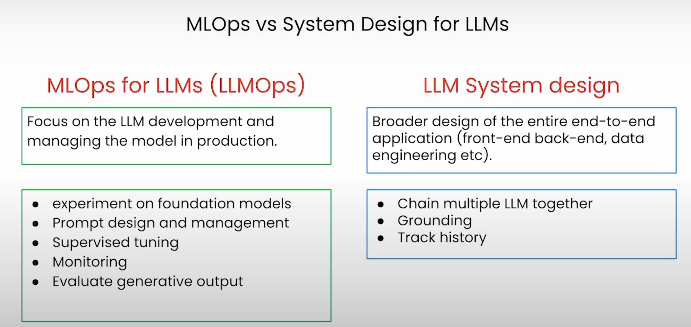
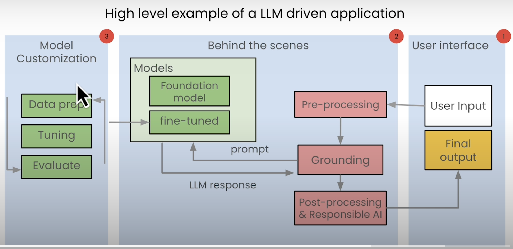
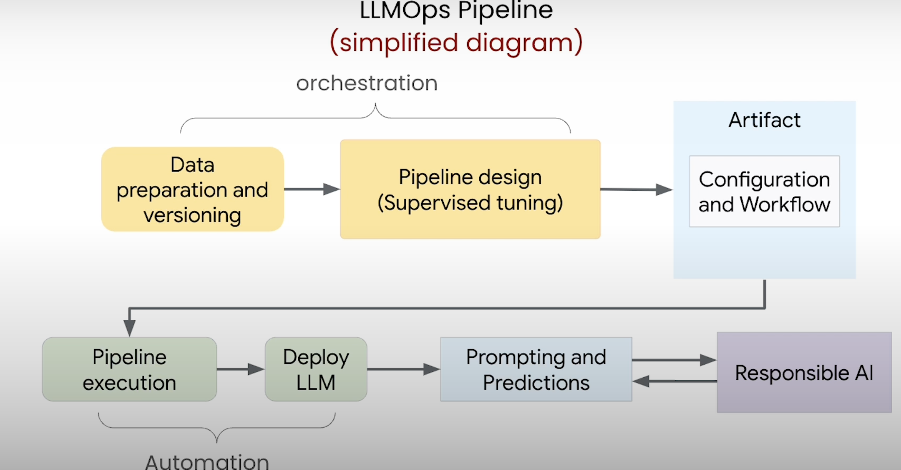

# Fundamentals

ML Ops is an ML engineering culture and practice that aims ate unifying ML development(Dev) and ML operation(Ops)

Automation and Monitoring at all steps of ML system construction, including:
- integration(data...)
- testing
- releasing
- deployment
- infrastructure management(i.e. GPU, CPU...)

## The MLOps framework

1. Data Ingestion
2. Data Validation
3. Data Transformation - LLM can understand - *
4. Model - *
5. Model Analysis
6. Serving *
7. Logging

With * are belong to Job Ochestration, otherwise Job Management, Monitoring

It's one dementional, one model per use case(i.e. summarization)

## LLMOps - MLOps for LLMs

Focus on the LLM development and managing the model in production.

Note about LLMOps:
- experiment on multiple foundation models for your use case
- think promopt design and managment for experiment and prod

- pre-precessing includes chunking ...
- grounding includes put the chunked user input into a prompt to feed the model and compare the LLM resp to the fact.

