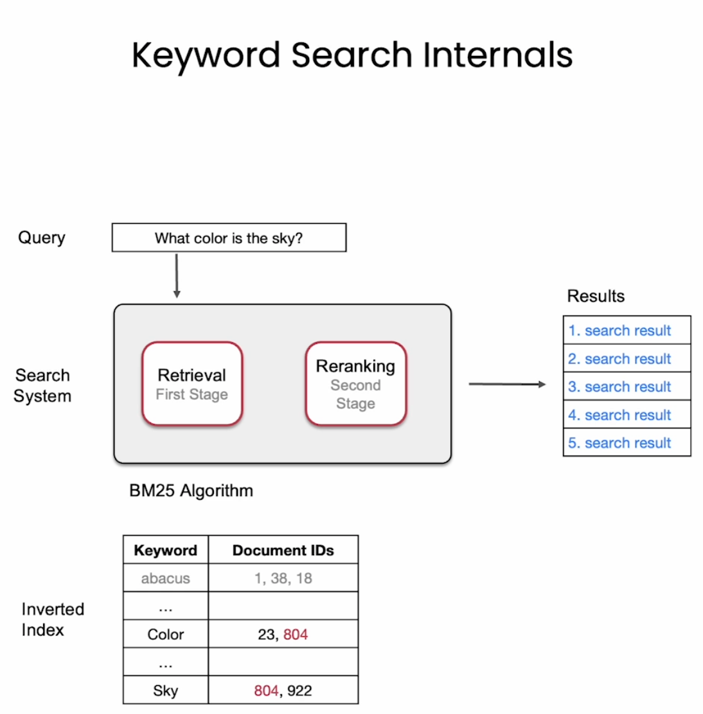

# Keyword Search

## Setup

Optional: To run locally, first do 

```py
# !pip install cohere
# !pip install weaviate-client
```
ENV

```py
import os
from dotenv import load_dotenv, find_dotenv
_ = load_dotenv(find_dotenv()) #read local .env file
```

imporing Weaviate to access the Wikipedia database.  Weaviate is an open source database. It has keyword search capabilities and also vector search capabilities that rely on language models.

```py
import weaviate
auth_config = weaviate.auth.AuthApiKey(
    api_key=os.environ['WEAVIATE_API_KEY'])

client = weaviate.Client(
    url=os.environ['WEAVIATE_API_URL'], # "https://cohere-demo.weaviate.network/" contains 10 million recoreds in 10 different languages, so 1 mil in eng
    auth_client_secret=auth_config,
    additional_headers={
        "X-Cohere-Api-Key": os.environ['COHERE_API_KEY'],
    }
)

client.is_ready() 
```

## Keyword Search



first stage, the retrieval, commonly uses the BM25 algorithm to score the documents in the archive versus the query. The implementation of the first stage retrieval often 
contains an inverted index.

Limitations: if we search a doc archive that has this other document that answers it exactly, but it uses different keywors, (e.g. strong pain in the side of the head vs sharp temple headache), keyword search is not going to
be able to retrieve this doc. LLM can help, bc they can look at the general meaning and they're able to retrieve a doc like this

bm_25 is the keyword search or lexical search algorithm commonly used, and it scores the documents in the archive versus the query based on a specific formula that
looks at the count of the shard words between the query and each document.

```py
def keyword_search(query,results_lang='en',properties = ["title","url","text"],num_results=3):
  where_filter = {
  "path":["lang"],
  "operator":"Equal",
  "valueString": results_lang
  }

response = (
        client.query.get("Articles", properties)
        .with_bm25(
            query=query
        )
        .with_where(where_filter)
        .with_limit(num_results)
        .do()
        )

result = response['data']['Get']['Articles']
return result

query = "What is the most viewed televised event?"
keyword_search_results = keyword_search(query)
print(keyword_search_results)

```
### Try modifying the search options
- Other languages to try: `en, de, fr, es, it, ja, ar, zh, ko, hi`

```py
properties = ["text", "title", "url", 
             "views", "lang"]

def print_result(result):
    """ Print results with colorful formatting """
    for i,item in enumerate(result):
        print(f'item {i}')
        for key in item.keys():
            print(f"{key}:{item.get(key)}")
            print()
        print()

print_result(keyword_search_results)
```

```py
query = "What is the most viewed televised event?"
keyword_search_results = keyword_search(query, results_lang='de')
print_result(keyword_search_results)
```

#  Embeddings

Embed words, sentences or articles. Embedding models optimized for seach put question close to answer. Resources which are similar in meaning are close to each other. This is used in Dense Retrieval.

# Dense Retrieval

## Part 1: Vector Database for semantic Search

Give way better results than keyword search. It can do cross language search.

Instead of bm25, use `with_near_text`.
```py
def dense_retrieval(query, 
                    results_lang='en', 
                    properties = ["text", "title", "url", "views", "lang", "_additional {distance}"],
                    num_results=5):

    nearText = {"concepts": [query]}
    
    # To filter by language
    where_filter = {
    "path": ["lang"],
    "operator": "Equal",
    "valueString": results_lang
    }
    response = (
        client.query
        .get("Articles", properties)
        .with_near_text(nearText)
        .with_where(where_filter)
        .with_limit(num_results)
        .do()
    )

    result = response['data']['Get']['Articles']

    return result
```
## Part 2: Building Semantic Search from Scratch

### Get the text archive:
from Interstellar WIKI page
```py
from annoy import AnnoyIndex
import numpy as np
import pandas as pd
import re

text = """
Interstellar is a 2014 epic science fiction film co-written, directed, and produced by Christopher Nolan.
It stars Matthew McConaughey, Anne Hathaway, Jessica Chastain, Bill Irwin, Ellen Burstyn, Matt Damon, and Michael Caine.
Set in a dystopian future where humanity is struggling to survive, the film follows a group of astronauts who travel through a wormhole near Saturn in search of a new home for mankind.

Brothers Christopher and Jonathan Nolan wrote the screenplay, which had its origins in a script Jonathan developed in 2007.
Caltech theoretical physicist and 2017 Nobel laureate in Physics[4] Kip Thorne was an executive producer, acted as a scientific consultant, and wrote a tie-in book, The Science of Interstellar.
Cinematographer Hoyte van Hoytema shot it on 35 mm movie film in the Panavision anamorphic format and IMAX 70 mm.
Principal photography began in late 2013 and took place in Alberta, Iceland, and Los Angeles.
Interstellar uses extensive practical and miniature effects and the company Double Negative created additional digital effects.

Interstellar premiered on October 26, 2014, in Los Angeles.
In the United States, it was first released on film stock, expanding to venues using digital projectors.
The film had a worldwide gross over $677 million (and $773 million with subsequent re-releases), making it the tenth-highest grossing film of 2014.
It received acclaim for its performances, direction, screenplay, musical score, visual effects, ambition, themes, and emotional weight.
It has also received praise from many astronomers for its scientific accuracy and portrayal of theoretical astrophysics. Since its premiere, Interstellar gained a cult following,[5] and now is regarded by many sci-fi experts as one of the best science-fiction films of all time.
Interstellar was nominated for five awards at the 87th Academy Awards, winning Best Visual Effects, and received numerous other accolades"""
```
### Chunking: 

Best practice , each chunk contains one idea.

```py
# Split into a list of sentences
texts = text.split('.')

# Clean up to remove empty spaces and new lines
texts = np.array([t.strip(' \n') for t in texts])

texts

# Split into a list of paragraphs
texts = text.split('\n\n')

# Clean up to remove empty spaces and new lines
texts = np.array([t.strip(' \n') for t in texts])

texts
```
Add more text to the chunk by prefixing the movie name
```py
# Split into a list of sentences
texts = text.split('.')

# Clean up to remove empty spaces and new lines
texts = np.array([t.strip(' \n') for t in texts])

title = 'Interstellar (film)'

texts = np.array([f"{title} {t}" for t in texts])

texts
```
### Get the embeddings:
```py
response = co.embed(
    texts=texts.tolist()
).embeddings

embeds = np.array(response)
embeds.shape
```
returns (15, 4096) - 15 sentences and each one is represented by a vector of 4000 numbers.

### Create the search index:

Throw them at a search lib, and start to be able to search them.
```py
search_index = AnnoyIndex(embeds.shape[1], 'angular')
# Add all the vectors to the search index
for i in range(len(embeds)):
    search_index.add_item(i, embeds[i])

search_index.build(10) # 10 trees
# save the index to file/disk. ann stands for approximate nearest neighbor.
search_index.save('test.ann')
```
```py
pd.set_option('display.max_colwidth', None)

def search(query):

  # Get the query's embedding
  query_embed = co.embed(texts=[query]).embeddings

  # Retrieve the nearest neighbors. Note that it the id, not original text
  similar_item_ids = search_index.get_nns_by_vector(query_embed[0],
                                                    3,
                                                  include_distances=True)
  # Format the results
  results = pd.DataFrame(data={'texts': texts[similar_item_ids[0]],
                              'distance': similar_item_ids[1]})

  print(texts[similar_item_ids[0]])
    
  return results
```
```py
query = "How much did the film make?"
search(query)
```


### ANN vector search vs Vector databases
Approximate Nearest-Neighbor
Vector search libraries
• Annoy - spotify
• FAISS -FB
• SCaNN - google

They are:
• Easy to set up
• Store vectors only

Vector databases
- Weaviate
- PostgreSQL
- Aldrant
- vespa
- Pinecone
- chroma
They are:
• Store vectors and text
• Easier to update (add new records)
• Allow filtering and more advanced queries


### Hybrid Search: keyword + vector

each search has a relevance score the we aggregate them, and we can add more signals (such as google's page rank)

Next step is rerank.

Recommanded reading: "Pretrained Transformers for text ranking: BERT and Beyond"

# ReRank

Dense Retrieval puts the query inside the embedding and then it returns the closest fo the responeses. It looks at similarities,
so it returns the response that is most similar to the question.

We can let Dense Retrieval returns top N responses close to the query then Rerank them. Rerank assigns to each query response pair a relevant score that tells you
how relevant the answer is with respect to the query. It could also be a document.

The way train re-rank is by giving it a lot of good pairs, a pair where the query and the response are very relevant, or whe nthe query and document are very relevant,
and trainning it to give those high relevane scores and then also giving it a big set of wrong query responses, close but may not correspond to it.

## Evaluation Search Systems

- Mean Average Precision (MAP)
- Mean Reciprocal Rank (MRR)
- Normalized Discounted Cumulative Gain (NDCG)

A good test set would be one containing queryies and correct responses, and then, you can compare these correct resp with the resp that the model gives you in a very similar way
 a syou would find the accuracy or precision, or recall of a classification model.
