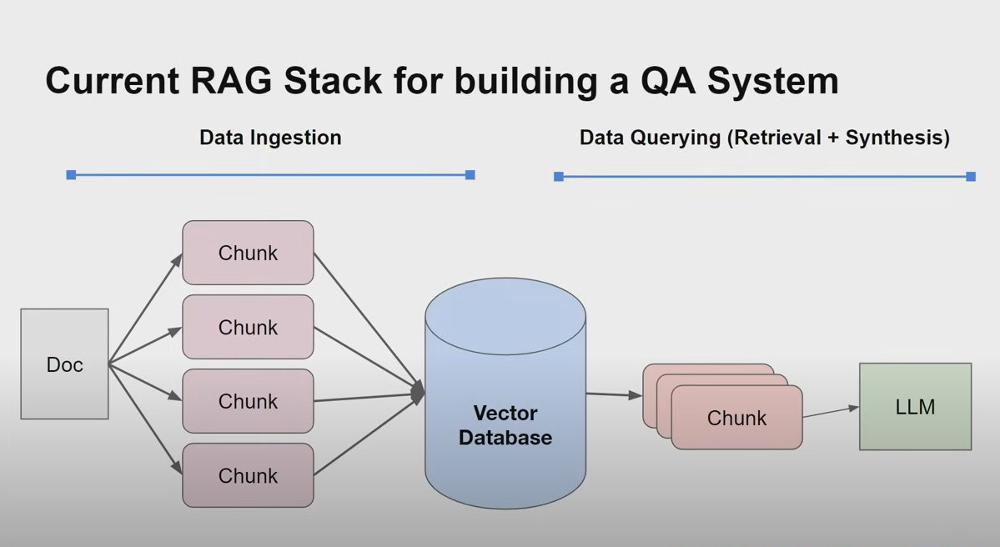
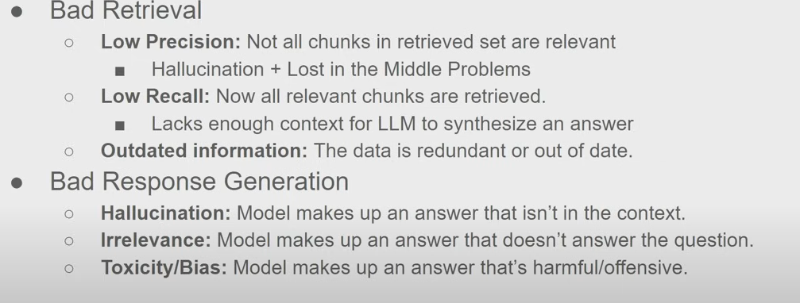
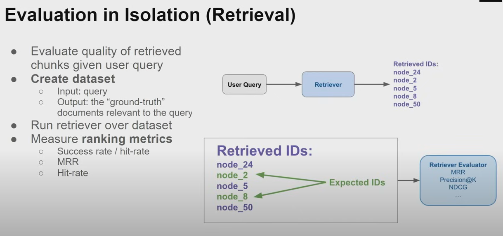
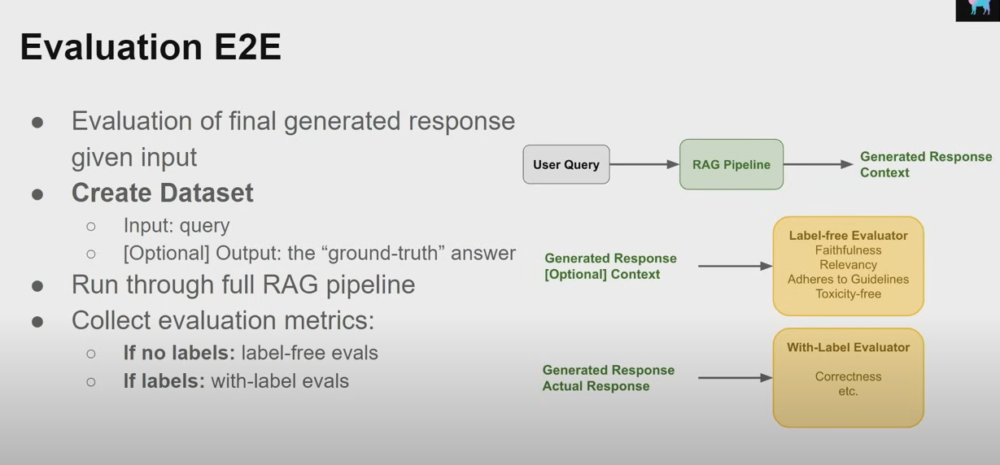
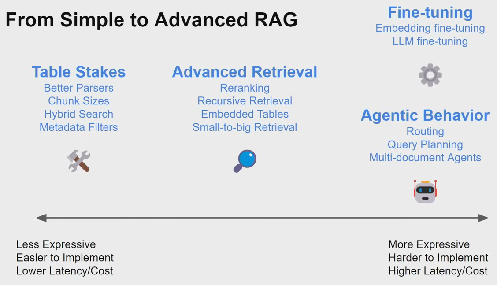
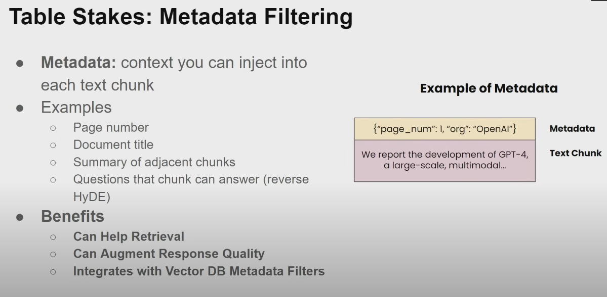
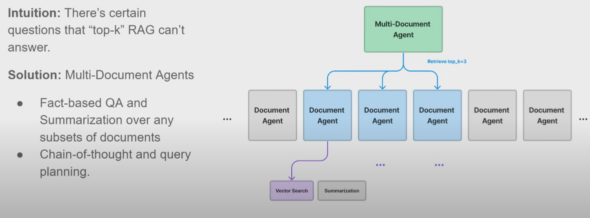
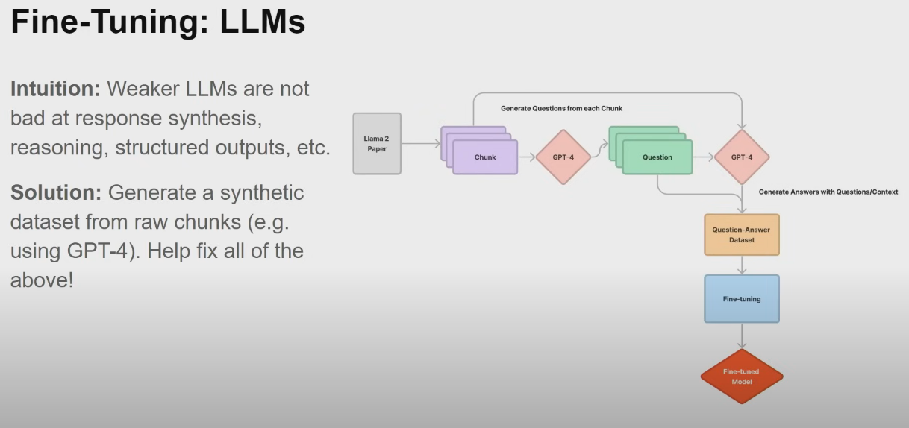

Retrieval Augmentation - Fix the model, put context into the prompt
Fine-turning - baking knowledge into the weights of the network

## "Naive" RAG stack for QA system

Usually response quality is bad.

## What can we do?

- First find a way to measure performance.

  - Evaluate in isolation- retrieval, synthesis
    - retrieval
      
      Now this becomes a classic IR problem
  - Evaluate e2e
    
    Data could be human generated or LLM(GPT4) generated. At the end, it becomes the LLM eval.

## Optimize RAG system

### Table Stacking
- chunk sizes
  
  Note: Reranking (shuffling context order) isn't always beneficial. Turning chunk size can have outsized impacts on performance. More retrieved tokens != higher performance(e.g. due tolost in middle prompt).
- metadata filtering
  
  Basically a json dictionary.

  

  Example: can you tell me the risk factors in 2021?  Raw semantic search is low precision. **top-4** No guarantee you will return the relevant document chunks.

  if we can infer the metadata filters(year=2021), we remove irrelevant candidatas.

### Advanced Retrieval

Embedding a big text chunk is suboptimal. So embed a smaller reference to the parent chunk(text at the sentence-level), then expand that window during LLM synthesis(use parent chunk for synthesis). Embed sentence links to expanded window - let LLM see before and after the sentence.
This leads to more precise retrieval, avoids "lost in the middle problems"

### Agentic Behavior

#### Multi-Document Agents

Because it may need a sequenece of reasoning steps to put together a piece of information, or you want to summerize a document and compare with other documents.

Each agent has access limit set of tools.

### Fine Tuning - 

#### Embeddings

Embedding representations are not optimzed over your dataset. You can generate a synthetic query dataset from raw text chunks using LLMs. Use this synthetic dataset to finetune an embedding model.

Given relavent questions to the question user might ask to retrieve the relavent answers.

Find tune an adaptor on top of the model is preferred to fine tune the model, because it's model independant and fine-tuning the query doesn't require reindexing the corpus. 

#### LLMs

Weaker models are slightly worse, fine-tune them with the data from the better models.

## Further Reading

[Building Performant RAG Applications for Production](https://github.com/ChrisGe4/learn-ai/blob/main/doc-data/Building-Performant-RAG.pdf)
  
